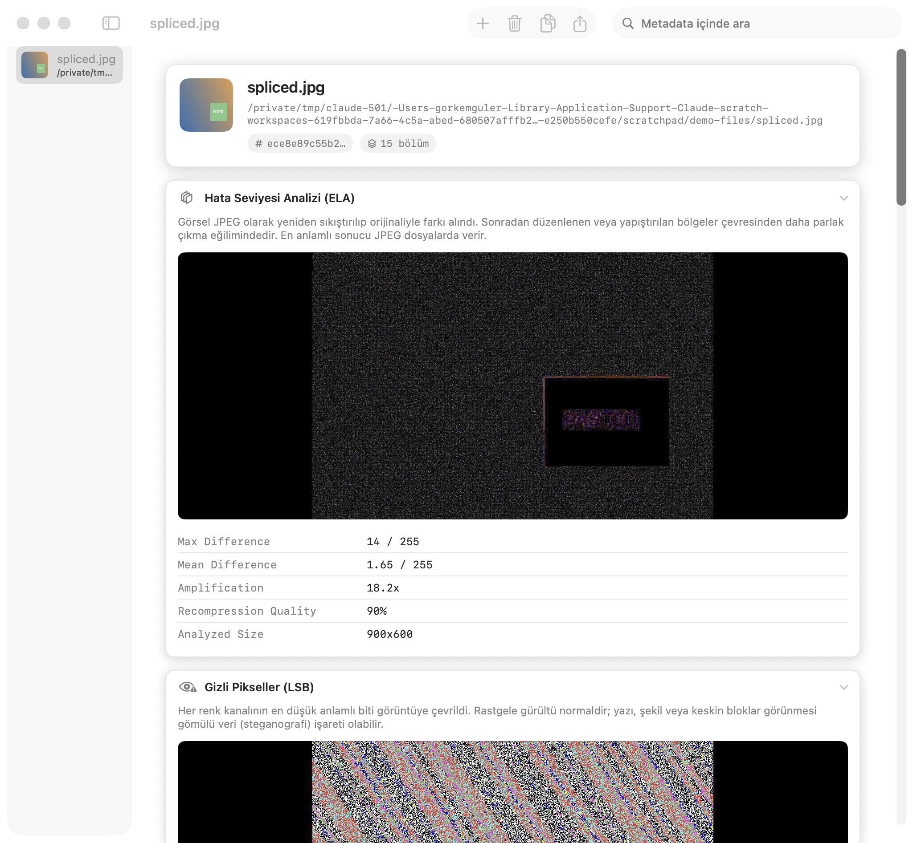

<p align="center">
  
</p>

<p align="center">
  
  
  
</p>

<p align="center"><sub>🇬🇧 English · <a href="README.tr.md">🇹🇷 Türkçe</a></sub></p>

A native macOS app that inspects the metadata hiding inside **any file, regardless of extension**. Built for CTF and OSINT work, where the file's metadata is often more interesting than its content.

Drop in a photo and see exactly where it was taken. Drop in a PDF, an Office document, an archive, or a stripped Mach-O binary and get every author name, timestamp, GPS coordinate, hash, embedded string, and linked library it's carrying. The same kind of leak-hunting that tools like FOCA or ExifTool provide, in one focused native app instead of a dozen terminal commands.

<p align="center">
  
</p>
<p align="center">
  
</p>
<p align="center">
  
</p>

*(Screenshots use synthetic sample files with fake names and GPS coordinates. No real personal data.)*

## Why

Most metadata tools are either a CLI you have to remember flags for (`exiftool`, `pdfinfo`, `otool`) or a bulk-scrubbing tool that assumes you already know what's in the file. MetaPeek is the missing middle: drag one file in, see everything it's leaking, in a UI built for actually reading the result rather than just dumping it.

## Features

- **General info**: size, timestamps, POSIX permissions, owner, UTI, magic-byte signature detection
- **Hashes**: MD5 / SHA1 / SHA256, streamed so large files don't blow up memory
- **Shannon entropy**: a visual gauge flags likely compressed, encrypted or packed content
- **Printable strings**: the first 200 printable strings, the same first move as `strings(1)` in forensics
- **Images**: EXIF, GPS, TIFF, IPTC, PNG/JFIF chunks (via Apple's ImageIO) plus an inline map preview when GPS is present
- **Error Level Analysis (ELA)**: re-compresses the image and amplifies the difference, so regions that were edited or pasted in stand out from the rest of the frame
- **Hidden Pixels (LSB)**: renders the least significant bit of every colour channel as an image, exposing LSB steganography, and counts fully transparent pixels that still carry colour data
- **JPEG structure**: reports the MCU block size, the true encoded canvas, and how many padding rows and columns the file carries beyond its displayed size, which is a hint that the image was cropped after encoding
- **PDF**: Author/Producer/CreationDate and the rest of the document dictionary, page count, encryption state
- **Office / OpenDocument**: `docProps`/`meta.xml` contents plus a full listing of every file inside the container
- **Archives**: zip/jar/apk/tar content listing
- **Audio/video**: duration, track info, embedded ID3/iTunes/QuickTime metadata
- **Mach-O / ELF / PE binaries**: architecture (`lipo`), linked libraries (`otool -L`), code signature and entitlements (`codesign`), handy for reversing an unknown downloaded binary
- **ExifTool enrichment**: if `exiftool` is installed (`brew install exiftool`), its output is merged in automatically for fields the native extractors miss
- **Export**: JSON export per file, or copy everything to the clipboard as text
- Interface follows **system light/dark mode**, and switches between **Turkish and English** automatically based on the system language

## Download

Grab the latest `.app` from the [releases page](https://github.com/gorkemguler/MetaPeek/releases), unzip, and move it to Applications. The build is ad-hoc signed rather than notarized, so the first launch needs a right-click (or Control-click) → **Open** → **Open** to get past Gatekeeper.

## Build from source

Requires macOS 15+ and Xcode 16+ command line tools.

```bash
git clone https://github.com/gorkemguler/MetaPeek.git
cd MetaPeek
./build_app.sh
open dist/MetaPeek.app
```

`build_app.sh` builds a release binary, assembles a proper `.app` bundle (icon, Info.plist), and ad-hoc signs it, which is enough to run locally. Distributing outside your own machine needs a Developer ID signature and notarization.

For iterative development:

```bash
swift run
```

## Command-line usage

Pass file paths and MetaPeek opens the GUI with them already loaded, the same convention as double-clicking a file or dragging it onto the Dock icon:

```bash
open -a MetaPeek suspicious.pdf photo.jpg
```

For scripting (CTF automation, bulk triage), add `--json` to skip the GUI entirely and get metadata as JSON on stdout:

```bash
MetaPeek.app/Contents/MacOS/MetaPeek --json suspicious.pdf | jq .
```

## Architecture

Extraction is split into independent `MetadataExtractor` implementations under `Sources/MetaPeek/Extractors/` (Image, PDF, Office, Archive, AudioVideo, MachO, ExifTool). Every file is run through all extractors that claim to handle it, and their sections are concatenated, so adding a new format is just adding one more extractor to `MetadataService.extractors`.

Image forensics (ELA, LSB) sits outside that pipeline in `ImageForensics`, because it produces pictures rather than key/value pairs. It runs on a downscaled copy of the image and stays on CoreGraphics so it never touches AppKit from a background task.

## Known limitations

- GPS location embedded in video files (ISO 6709) is shown as raw text, not yet plotted on the map
- Embedded PDF JavaScript and attachments aren't enumerated yet
- ELA is most meaningful on JPEG files; on lossless formats it mostly highlights flat regions

## License

MIT, see [LICENSE](LICENSE).
