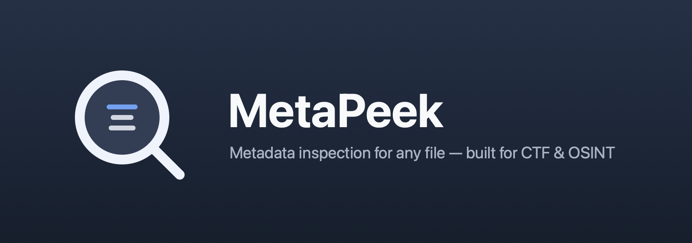
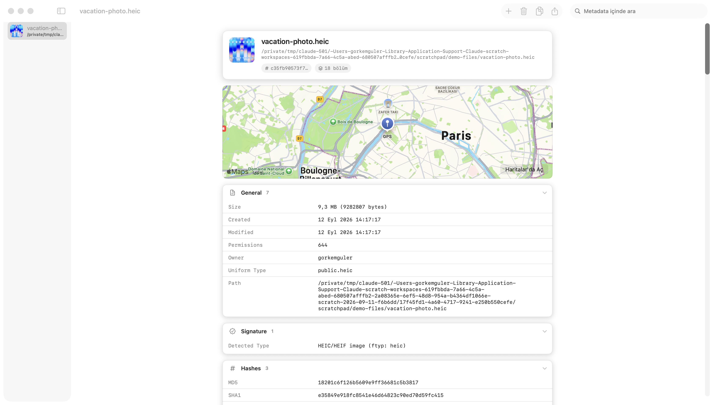
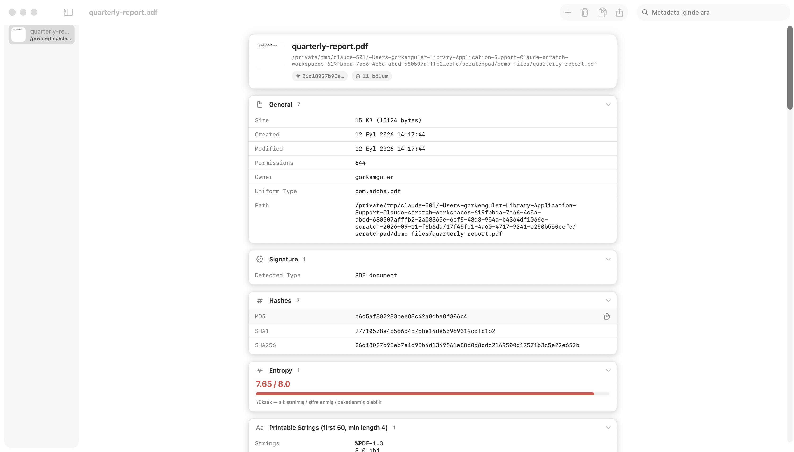

<p align="center">
  
</p>

<p align="center">
  
  
  
</p>

<p align="center"><sub><a href="README.md">🇬🇧 English</a> · 🇹🇷 Türkçe</sub></p>

**Uzantısı ne olursa olsun** herhangi bir dosyanın içinde saklı metadata'yı gösteren native bir macOS uygulaması. CTF ve OSINT çalışmaları için tasarlandı — bu işlerde dosyanın metadata'sı çoğu zaman içeriğinden daha değerlidir.

Bir fotoğrafı sürükleyip bırakın, nerede çekildiğini görün. Bir PDF, Office dokümanı, arşiv ya da kaynağı bilinmeyen bir Mach-O binary'si atın; taşıdığı bütün yazar adlarını, zaman damgalarını, GPS koordinatlarını, hash'leri, gömülü string'leri ve bağlı kütüphaneleri alın. FOCA veya ExifTool'un yaptığı sızıntı avcılığının aynısı, ama bir düzine terminal komutu yerine tek bir native uygulamada.

<p align="center">
  
</p>
<p align="center">
  
</p>

*(Ekran görüntülerinde tamamen sahte örnek dosyalar kullanıldı — gerçek kişisel veri yok.)*

## Neden?

Mevcut metadata araçları ya bayraklarını ezberlemeniz gereken birer CLI (`exiftool`, `pdfinfo`, `otool`), ya da dosyanın içinde ne olduğunu zaten bildiğinizi varsayan toplu temizleme araçları. MetaPeek aradaki boşluğu dolduruyor: tek dosyayı sürükleyin, neyi sızdırdığını görün — hem de çıktıyı ekrana dökmek yerine gerçekten okunmak üzere tasarlanmış bir arayüzde.

## Özellikler

- **Genel bilgi** — boyut, tarihler, POSIX izinleri, sahip, UTI, magic-byte imza tespiti
- **Hash'ler** — MD5 / SHA1 / SHA256, akış halinde hesaplanır; büyük dosyalar belleği şişirmez
- **Shannon entropisi** — görsel gösterge, sıkıştırılmış/şifrelenmiş/paketlenmiş içerik ihtimalini işaret eder
- **Yazdırılabilir string'ler** — ilk 200 string; adli analizde `strings(1)` ile atılan ilk adımın aynısı
- **Görseller** — EXIF, GPS, TIFF, IPTC, PNG/JFIF chunk'ları (Apple ImageIO ile) ve GPS varsa satır içi harita önizlemesi
- **PDF** — Author/Producer/CreationDate ve doküman sözlüğünün geri kalanı, sayfa sayısı, şifreleme durumu
- **Office / OpenDocument** — `docProps`/`meta.xml` içeriği ve konteyner içindeki tüm dosyaların listesi
- **Arşivler** — zip/jar/apk/tar içerik listesi
- **Ses/video** — süre, track bilgisi, gömülü ID3/iTunes/QuickTime metadata'sı
- **Mach-O / ELF / PE binary'ler** — mimari (`lipo`), bağlı kütüphaneler (`otool -L`), kod imzası ve entitlement'lar (`codesign`) — indirilmiş, kaynağı belirsiz bir binary'yi incelerken işe yarar
- **ExifTool zenginleştirmesi** — sistemde `exiftool` kuruluysa (`brew install exiftool`), native çıkarıcıların yakalayamadığı alanlar otomatik olarak eklenir
- **Dışa aktarma** — dosya başına JSON export ya da her şeyi metin olarak panoya kopyalama
- Arayüz **sistemin açık/koyu temasını** takip eder ve sistem diline göre otomatik olarak **Türkçe veya İngilizce** açılır

## İndirme

Hazır `.app` dosyasını [releases sayfasından](https://github.com/gorkemguler/MetaPeek/releases) indirin, zip'ten çıkarın ve Uygulamalar klasörüne taşıyın. Build ad-hoc imzalı (notarize edilmemiş) olduğu için ilk açılışta Gatekeeper'ı geçmek gerekir: uygulamaya sağ tık (ya da Control-tık) → **Aç** → çıkan pencerede tekrar **Aç**.

## Kaynaktan derleme

macOS 15+ ve Xcode 16+ komut satırı araçları gerekir.

```bash
git clone https://github.com/gorkemguler/MetaPeek.git
cd MetaPeek
./build_app.sh
open dist/MetaPeek.app
```

`build_app.sh` release binary'sini derler, düzgün bir `.app` paketi (ikon, Info.plist) oluşturur ve ad-hoc imzalar — kendi makinenizde çalıştırmak için bu yeterli. Başka makinelere dağıtmak için Developer ID imzası ve notarization gerekir.

Geliştirme sırasında hızlı denemeler için:

```bash
swift run
```

## Komut satırı kullanımı

Dosya yolu verdiğinizde MetaPeek arayüzü o dosyalar yüklü olarak açılır — dosyaya çift tıklamak ya da Dock ikonuna sürüklemekle aynı davranış:

```bash
open -a MetaPeek supheli.pdf foto.jpg
```

Script içinde kullanmak için (CTF otomasyonu, toplu triyaj) `--json` bayrağını ekleyin; arayüz hiç açılmaz, metadata stdout'a JSON olarak basılır:

```bash
MetaPeek.app/Contents/MacOS/MetaPeek --json supheli.pdf | jq .
```

## Mimari

Metadata çıkarımı `Sources/MetaPeek/Extractors/` altında bağımsız `MetadataExtractor` implementasyonlarına bölünmüştür (Image, PDF, Office, Archive, AudioVideo, MachO, ExifTool). Her dosya, kendisini işleyebileceğini bildiren tüm çıkarıcılardan geçer ve üretilen bölümler birleştirilir — yeni bir format eklemek, `MetadataService.extractors` listesine bir çıkarıcı daha eklemekten ibarettir.

## Bilinen sınırlamalar

- Video dosyalarındaki GPS konumu (ISO 6709) ham metin olarak gösteriliyor, henüz haritaya işlenmiyor
- PDF içine gömülü JavaScript ve ek dosyalar henüz listelenmiyor

## Lisans

MIT — [LICENSE](LICENSE) dosyasına bakın.
